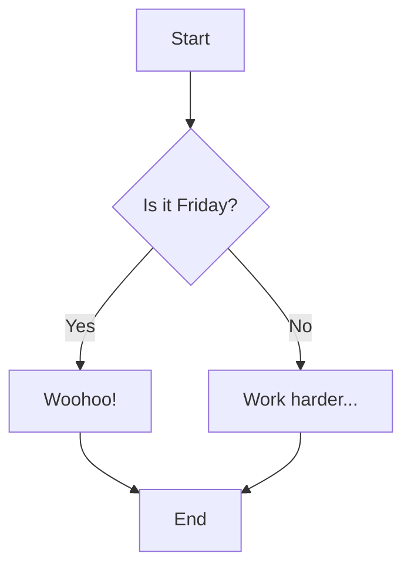

# Plan: Implementing Mermaid.js Diagrams for Visualizations

## 1. Introduction and Goals

**1.1. What is Mermaid.js?**
Mermaid.js is a JavaScript-based diagramming and charting tool that uses Markdown-inspired text definitions to create and modify diagrams dynamically. It supports various diagram types, including flowcharts, sequence diagrams, Gantt charts, class diagrams, state diagrams, and more.

**1.2. Why Integrate Mermaid.js?**
Integrating Mermaid.js into the Gemini Chatbot will enhance its capabilities by:
-   Allowing the AI to generate and present complex information visually (e.g., process flows, system architectures, decision trees).
-   Making abstract concepts easier to understand for the user.
-   Providing a richer, more engaging user experience beyond plain text and tables.
-   Leveraging a text-based format that AI models can easily generate.

**1.3. High-Level Implementation Strategy**
The core strategy involves:
1.  Installing and initializing the Mermaid.js library.
2.  Instructing the AI to output Mermaid syntax within designated Markdown code blocks.
3.  Customizing the `react-markdown` component (`ChatMessageItem.tsx`) to detect these code blocks.
4.  Using Mermaid.js to render the syntax into SVG diagrams within these custom-handled blocks.
5.  Configuring `rehype-sanitize` to allow the SVG elements and attributes generated by Mermaid.
6.  Styling the diagrams to fit the application's theme.
7.  Updating the system prompt to inform the AI about this new capability.

## 2. Prerequisites and Dependencies

**2.1. Mermaid.js Library:**
-   The primary dependency is the `mermaid` library itself.
-   **Decision:** We will install it via npm/yarn for better version control and integration with Vite's bundling and tree-shaking capabilities. This is generally more robust than adding it to the `importmap` for a library of this nature.

**2.2. TypeScript Typings (Optional but Recommended):**
-   If available and stable, `@types/mermaid` would be installed for better type safety.
-   **Refinement:** If official types are lacking or cause issues, we will create a minimal local declaration file (e.g., `src/types/mermaid.d.ts`):
    ```typescript
    // src/types/mermaid.d.ts
    declare module 'mermaid' {
      interface MermaidAPI {
        initialize: (config: any) => void;
        run: (options?: { nodes?: HTMLElement[]; suppressErrors?: boolean }) => Promise<void>;
        render: (id: string, txt: string, cb?: (svgCode: string, bindFunctions?: (element: Element) => void) => void, container?: Element) => string;
        // Add other methods as needed
      }
      const mermaidAPI: MermaidAPI;
      export default mermaidAPI; // Or export { mermaidAPI as mermaid } or similar, depending on actual library structure
    }
    ```
    This ensures some level of type checking even with imperfect official typings.

## 3. Installation

**3.1. Install Mermaid.js via npm/yarn:**
Execute the following command in the project's root directory:
```bash
npm install mermaid
# or
# yarn add mermaid
```
Vite will handle the `import mermaid from 'mermaid';` statement correctly.

**3.2. Install TypeScript Typings (if pursuing):**
```bash
npm install --save-dev @types/mermaid
# or
# yarn add --dev @types/mermaid
```
*(If this package doesn't exist, causes issues, or is incomplete, we will rely on the local declaration file as per 2.2)*

## 4. Mermaid Library Initialization

**4.1. Where to Initialize:**
Mermaid needs to be initialized once when the application loads. `App.tsx` component, within a `useEffect` hook that runs only once on mount, is appropriate.

**4.2. How to Initialize:**
Import Mermaid and call its `initialize` method.
```typescript
// Example: In App.tsx
import React, { useEffect } from 'react'; // Assuming React is used
import mermaid from 'mermaid';

useEffect(() => {
  mermaid.initialize({
    startOnLoad: false, // We will trigger rendering manually
    theme: 'dark',      // Consistent with app's dark theme. Consider 'base' or 'neutral' for more CSS control.
    fontFamily: '"Inter", sans-serif', // Match application's font
    // securityLevel: 'strict', // Good default for AI-generated content
    logLevel: 3, // 1 (fatal) to 5 (debug) - Adjust for development/production
    // Example: Using themeVariables for granular control if 'dark' theme isn't perfect
    // themeVariables: {
    //   primaryColor: '#2563eb', // Example: blue-600
    //   primaryTextColor: '#e2e8f0', // Example: slate-200
    //   lineColor: '#475569', // Example: slate-600
    //   // ... and other variables as per Mermaid documentation
    // }
  });
  console.log("[App.tsx] Mermaid.js initialized.");
}, []);
```

**4.3. Key Configuration Options:**
-   `startOnLoad: false`: Crucial. We control rendering manually.
-   `theme: 'dark'`: Align with the application's dark theme. `'base'` or `'neutral'` themes combined with `themeVariables` or custom CSS can offer more styling flexibility.
-   `fontFamily`: Explicitly set to match the application's font (e.g., `"Inter", sans-serif`).
-   `securityLevel: 'strict'`: Recommended for AI-generated content.
-   `logLevel`: Controls Mermaid's logging verbosity.
-   `themeVariables`: Offers fine-grained control over theme colors if predefined themes are not sufficient.

## 5. Markdown Syntax for Mermaid Diagrams

**5.1. Defined Syntax:**
The AI will be instructed to provide Mermaid diagram definitions within standard Markdown fenced code blocks, using the language identifier `mermaid`.

**5.2. Example:**
```markdown

```

## 6. Integration with `react-markdown` (`ChatMessageItem.tsx`)

This requires customization of the `code` component renderer.

**6.1. Customizing the `code` Component Renderer:**
Modify the `components` prop passed to `ReactMarkdown`.

```typescript
// In ChatMessageItem.tsx
import React, { useEffect, useRef, useId } from 'react';
import mermaid from 'mermaid';
// import LoadingSpinner from './LoadingSpinner'; // If using a custom spinner
// ... other imports

const markdownComponents = {
  // ... other custom components (a, existing code for syntax highlighting) ...
  code({ node, inline, className, children, ...props }: any) {
    const match = /language-(\w+)/.exec(className || '');
    const language = match && match[1];

    if (!inline && language === 'mermaid') {
      const mermaidId = `mermaid-diagram-${useId()}`;
      const mermaidCode = String(children).trim();
      const containerRef = useRef<HTMLDivElement>(null);
      const [isLoadingDiagram, setIsLoadingDiagram] = React.useState(true); // For loading state
      const [errorDiagram, setErrorDiagram] = React.useState<string | null>(null); // For error state


      useEffect(() => {
        if (containerRef.current && mermaidCode) {
          setIsLoadingDiagram(true);
          setErrorDiagram(null);
          containerRef.current.textContent = mermaidCode; // Set text content for mermaid.run

          mermaid.run({
            nodes: [containerRef.current],
          }).then(() => {
            if (containerRef.current) {
              const svgElement = containerRef.current.querySelector('svg');
              if (svgElement) {
                containerRef.current.innerHTML = ''; 
                containerRef.current.appendChild(svgElement);
              }
            }
            setIsLoadingDiagram(false);
          }).catch(err => {
            console.error("[ChatMessageItem.tsx] Mermaid.run failed:", err);
            setErrorDiagram(err.message || 'Unknown error rendering diagram');
            if (containerRef.current) {
                containerRef.current.innerHTML = `<pre class="mermaid-error-display">Error: ${err.message || 'Unknown error'}\n\n${mermaidCode}</pre>`;
            }
            setIsLoadingDiagram(false);
          });
        } else if (containerRef.current) {
             containerRef.current.innerHTML = '';
             setIsLoadingDiagram(false);
        }
      }, [mermaidCode]);

      if (isLoadingDiagram) {
        return (
          <div ref={containerRef} className="mermaid-diagram-container mermaid-loading" aria-label="Mermaid diagram loading" role="status">
            Loading diagram...
          </div>
        );
      }
      
      return (
        <div
          id={mermaidId} 
          ref={containerRef}
          className="mermaid-diagram-container"
          aria-label="Mermaid diagram"
        >
          {!mermaidCode && !isLoadingDiagram && !errorDiagram ? <div className="p-2 text-sm text-slate-500">(Empty Mermaid block)</div> : null}
        </div>
      );

    } else if (!inline && match) {
      // Existing syntax highlighter logic for other code blocks
      return (
        <SyntaxHighlighter /* ... existing props ... */ >
          {String(children).replace(/\n$/, '')}
        </SyntaxHighlighter>
      );
    } else {
      // Inline code
      return (
        <code className={`text-current ${className}`} {...props}>
          {children}
        </code>
      );
    }
  },
};
```

**6.2. Rendering Logic Details:**
-   **Detect `language-mermaid`:** Identify code blocks.
-   **`useId`, `useRef`, `useState`:** For unique IDs, container reference, and managing loading/error states per diagram.
-   **`useEffect` for Rendering:**
    -   Call `mermaid.run()` after the DOM element is available.
    -   Depend on `mermaidCode`.
    -   **DOM Cleanup:** Critical step. After `mermaid.run()` successfully appends/replaces with an SVG, the original `textContent` (the Mermaid code) must be removed from the container to avoid displaying both the code and the diagram. The container's `innerHTML` should be set to just the SVG.
    -   **Error Handling:** Catch errors from `mermaid.run()`. Display a custom error message, potentially including the raw Mermaid code, inside a `<pre class="mermaid-error-display">`.
    -   **Loading State:** The `div` initially shows "Loading diagram..." (or a spinner). `isLoadingDiagram` state controls this.

## 7. Styling Mermaid Diagrams

**7.1. Mermaid Themes:**
-   Set via `mermaid.initialize({ theme: 'dark', fontFamily: 'Inter, sans-serif' })`.

**7.2. Custom CSS (`index.html`):**
```css
/* In index.html */
.mermaid-diagram-container {
  padding: 1em; 
  border-radius: 0.375rem; /* rounded-md */
  margin-top: 0.5em;
  margin-bottom: 1em;
  overflow-x: auto; /* For wide diagrams */
}
.mermaid-diagram-container.mermaid-loading {
  display: flex;
  align-items: center;
  justify-content: center;
  min-height: 80px; 
  color: #9ca3af; /* slate-400 */
  font-style: italic;
}
.mermaid-diagram-container svg {
  display: block; 
  max-width: 100%;
  height: auto;
}

.mermaid-diagram-container pre.mermaid-error-display {
    background-color: #334155; /* slate-700 */
    color: #f87171; /* red-400 */
    padding: 0.75em;
    border-radius: 0.25rem; /* rounded-sm */
    font-family: 'Menlo', 'Consolas', monospace; 
    font-size: 0.8em;
    white-space: pre-wrap;
    border: 1px solid #4b5563; /* slate-600 */
    margin: 0; 
}
```

## 8. Updating `rehype-sanitize` Configuration

Extend `rehype-sanitize` schema in `ChatMessageItem.tsx`.

**8.1. Syntax for `react-markdown` v9+:**
The syntax `rehypePlugins={[rehypeSanitize(customSanitizeSchema)]}` is likely correct, where `rehypeSanitize` is the default import from `rehype-sanitize` and `customSanitizeSchema` is your options object. This means `rehypeSanitize(options)` returns the configured plugin attacher.

**8.2. Configuration Example:**
```typescript
// In ChatMessageItem.tsx
import rehypeSanitize, { defaultSchema } from 'rehype-sanitize';
// ...
const customSanitizeSchema = {
  ...defaultSchema,
  tagNames: [
    ...(defaultSchema.tagNames || []),
    'svg', 'g', 'path', 'rect', 'circle', 'ellipse', 'line', 'polyline', 'polygon',
    'text', 'tspan', 'textPath', 'defs', 'marker', 'symbol', 'use', 'foreignObject',
  ],
  attributes: {
    ...defaultSchema.attributes,
    div: [ 
      ...(defaultSchema.attributes?.div || []),
      'id', 'className', 'data-mermaid', 'aria-label', 'role', 
    ],
    svg: [
      ...(defaultSchema.attributes?.svg || []),
      'xmlns', 'viewBox', 'width', 'height', 'preserveAspectRatio', 'style', 'class',
      'aria-labelledby', 'role', 'font-family', 
    ],
    path: ['d', 'fill', 'stroke', 'stroke-width', 'stroke-linecap', 'stroke-linejoin', 'stroke-dasharray', 'marker-start', 'marker-end', 'marker-mid', 'style', 'class'],
    rect: ['x', 'y', 'width', 'height', 'rx', 'ry', 'fill', 'stroke', 'stroke-width', 'style', 'class'],
    circle: ['cx', 'cy', 'r', 'fill', 'stroke', 'stroke-width', 'style', 'class'],
    ellipse: ['cx', 'cy', 'rx', 'ry', 'fill', 'stroke', 'stroke-width', 'style', 'class'],
    line: ['x1', 'y1', 'x2', 'y2', 'stroke', 'stroke-width', 'style', 'class', 'marker-start', 'marker-end'],
    polyline: ['points', 'fill', 'stroke', 'stroke-width', 'style', 'class'],
    polygon: ['points', 'fill', 'stroke', 'stroke-width', 'style', 'class'],
    text: ['x', 'y', 'dx', 'dy', 'fill', 'stroke', 'font-family', 'font-size', 'font-weight', 'text-anchor', 'dominant-baseline', 'style', 'class'],
    tspan: ['x', 'y', 'dx', 'dy', 'style', 'class', 'fill'],
    marker: ['id', 'viewBox', 'markerWidth', 'markerHeight', 'refX', 'refY', 'orient', 'markerUnits', 'style', 'class', 'fill'],
    use: ['href', 'xlink:href', 'x', 'y', 'width', 'height', 'style', 'class', 'fill'],
    foreignObject: ['x', 'y', 'width', 'height', 'style', 'class'],
    '*': [ 
      ...(defaultSchema.attributes?.['*'] || []),
      'className', 'style', 
    ],
  },
};
```

## 9. System Prompt Update (`hooks/useChatSettings.ts`)

Modify `DEFAULT_SYSTEM_INSTRUCTION`:
```diff
// In hooks/useChatSettings.ts
export const DEFAULT_SYSTEM_INSTRUCTION = \`...
- Horizontal Rules (\`---\`)
+ - Mermaid Diagrams for flowcharts, sequence diagrams, etc. Use a \`\`\`mermaid code block:
+   \`\`\`mermaid
+   graph TD;
+     A[Client] --> B(Load Balancer);
+     B --> C[Server1];
+     B --> D[Server2];
+   \`\`\`

When presenting code, always use fenced code blocks. For structured information, consider lists, tables, or task lists. For visual flows or diagrams, use Mermaid syntax.
+ (Optional hint: Aim for clarity; simpler diagrams are often better in a chat format unless detailed complexity is specifically requested.)
\`;
```

## 10. Accessibility (A11y) Considerations

-   Ensure diagram containers have `aria-label` or similar.
-   Mermaid can include `<title>`/`<desc>` in SVGs. Encourage AI to use descriptive titles in Mermaid syntax if possible.
-   Verify color contrast.

## 11. Potential Challenges & Edge Cases

-   Performance with many/complex diagrams.
-   Complex HTML in labels (if `htmlLabels` enabled – current plan assumes off).
-   Theme consistency.
-   Robust error handling for `mermaid.run()`.

## 12. Testing and Verification Plan

This section outlines how to test and verify the Mermaid diagram implementation once the steps in Sections 1-9 are completed.

**12.1. Verification of Initial Setup & Basic Rendering**
    - **Test:** After application startup, check the browser's console logs.
    - **Verify:** Confirm that the "[App.tsx] Mermaid.js initialized." log message appears without any errors from Mermaid initialization.
    - **Test:** (Developer Tool) Temporarily add a hardcoded Mermaid string and rendering call in a test component or `App.tsx`.
    - **Verify:** The diagram renders. The basic theme and font specified in `mermaid.initialize` are applied.

**12.2. Verification of `react-markdown` Integration**
    - **Test:** Send a message to the AI (or manually construct a `Message` object in developer tools) that contains a simple, valid Mermaid code block (e.g., the example from Section 5.2).
    - **Verify:**
        - The custom `code` renderer in `ChatMessageItem.tsx` is invoked for the `language-mermaid` block.
        - The "Loading diagram..." message (or spinner) appears briefly.
        - The diagram renders correctly within the chat message bubble.
        - The original Mermaid code text is removed from the DOM container after the SVG is rendered (inspect element to confirm only SVG is present in `div.mermaid-diagram-container`).
        - No console errors related to `mermaid.run()` or the `useEffect` hook in `ChatMessageItem.tsx`.

**12.3. Verification of Error Handling**
    - **Test:** Send a message with intentionally broken/invalid Mermaid syntax (e.g., `graph TD; A-- B`).
    - **Verify:**
        - The error state (`errorDiagram`) within the `ChatMessageItem`'s custom `code` renderer is triggered.
        - A user-friendly error message and the original (broken) Mermaid code are displayed inside the styled `<pre class="mermaid-error-display">` block.
        - No JavaScript errors crash the application.
    - **Test:** Send an empty Mermaid block (e.g., ```mermaid\n```).
    - **Verify:** The component handles this gracefully (e.g., shows "(Empty Mermaid block)" or an empty container, with no console errors).

**12.4. Verification of Styling and Theme Consistency**
    - **Test:** Generate various types of Mermaid diagrams (e.g., flowcharts with different shapes, sequence diagrams). Include wide diagrams that would require horizontal scrolling.
    - **Verify:**
        - Diagrams are legible, aesthetically pleasing, and consistent with the application's dark theme.
        - The `overflow-x: auto` on `.mermaid-diagram-container` works correctly for wide diagrams.
        - Styles for `.mermaid-diagram-container`, `.mermaid-loading`, and `.mermaid-error-display` are applied as defined in `index.html`.
        - Fonts within the diagrams match the application's font.

**12.5. Verification of `rehype-sanitize` Configuration**
    - **Test:** Systematically generate or send messages containing different Mermaid diagram types that utilize a wide range of SVG elements and attributes (e.g., flowcharts, sequence diagrams, class diagrams, state diagrams, Gantt charts if feasible).
    - **Verify:**
        - All parts of the diagrams render correctly.
        - No essential SVG elements or attributes are stripped by `rehype-sanitize` (inspect the rendered SVG DOM structure).
        - The browser console shows no sanitization errors or warnings related to Mermaid SVGs.
        - Complex diagrams with various node shapes, edge types, and text labels are fully rendered.

**12.6. Verification of System Prompt and AI Interaction**
    - **Test:** After the system prompt is updated, engage in a conversation with the AI. Specifically instruct it to generate different types of diagrams based on scenarios (e.g., "Show me a flowchart for making coffee," "Generate a sequence diagram for a user login process").
    - **Verify:**
        - The AI understands and uses the ```mermaid code block syntax.
        - AI-generated diagrams render correctly.
        - The AI attempts to use Mermaid for appropriate visual tasks.

**12.7. Verification of Accessibility (A11y) and Final Checks**
    - **Test:** Use browser developer tools to inspect the ARIA attributes.
    - **Verify:**
        - Diagram containers (`div.mermaid-diagram-container`) have an appropriate `aria-label` (e.g., "Mermaid diagram").
        - Color contrast within diagrams is acceptable, especially if custom theming is applied heavily. (Mermaid's default dark theme is generally good).
    - **Test:** Review the browser console for any warnings or errors during interaction with messages containing diagrams.
    - **Verify:** The application remains stable and performant when messages with diagrams are present and rendered.

**12.8. Cross-browser Verification (Basic)**
    - **Test:** Render and interact with messages containing Mermaid diagrams in the latest versions of target browsers (e.g., Chrome, Firefox, Safari if available).
    - **Verify:** Diagrams render consistently, and functionality (loading, error display, styling) is comparable across browsers.

## 13. Documentation and Cleanup

-   Document the Mermaid integration details, especially the `rehype-sanitize` schema choices and the custom `code` renderer logic within `ChatMessageItem.tsx`.
-   Ensure any temporary test code, excessive console logs, or commented-out experimental code related to this feature are removed or appropriately commented for future reference.
```